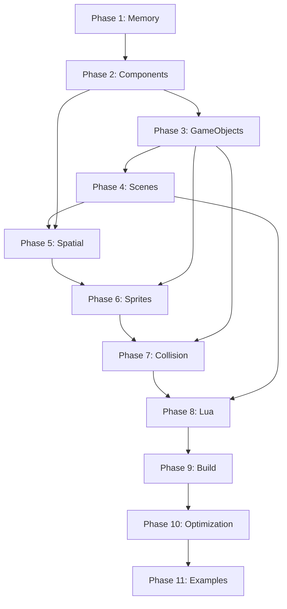

# Playdate Engine Development Tasks

This directory contains detailed implementation plans for building a high-performance game development engine for the Playdate console. Each phase represents a complete, testable milestone in the engine development process.

## Overview

The Playdate Engine is designed as a high-performance, C-based game development toolkit with optional Lua scripting support. The engine targets ambitious performance goals:

- **50,000+ GameObjects** updated per frame
- **10,000+ collision checks** per frame  
- **1000+ sprites** rendered at 30 FPS
- **Sub-millisecond** response times for core operations
- **< 5% memory overhead** for engine management

## Development Phases

### Foundation (Phases 1-2)

1. **[Memory Management](phase-1-memory-management.md)** - High-performance object pools with ARM optimization
2. **[Component System](phase-2-component-system.md)** - Type-safe, bitmask-based component architecture

### Core Systems (Phases 3-4)

3. **[GameObject & Transform](phase-3-gameobject-transform.md)** - Entity management with transform hierarchies
4. **[Scene Management](phase-4-scene-management.md)** - GameObject organization and lifecycle management

### Performance & Rendering (Phases 5-6)

5. **[Spatial Partitioning](phase-5-spatial-partitioning.md)** - Grid-based collision optimization
6. **[Sprite Component](phase-6-sprite-component.md)** - Hardware-accelerated rendering with Playdate SDK

### Physics & Scripting (Phases 7-8)

7. **[Collision Component](phase-7-collision-component.md)** - AABB collision detection with spatial integration
8. **[Lua Bindings](phase-8-lua-bindings.md)** - Complete C-to-Lua API with minimal overhead

### Infrastructure & Polish (Phases 9-11)

9. **[Build System](phase-9-build-system.md)** - CMake integration with Playdate SDK toolchain
10. **[Optimization & Profiling](phase-10-optimization.md)** - Performance analysis and optimization tools
11. **[Integration Examples](phase-11-integration-examples.md)** - Complete games and learning resources

## Task Structure

Each task file contains:

- **Objective**: Clear goals and success criteria
- **Prerequisites**: Dependencies on other phases
- **Technical Specifications**: Performance targets and architectural requirements
- **Implementation Steps**: Detailed coding tasks with complete examples
- **Unit Tests**: Comprehensive testing strategy with performance validation
- **Integration Points**: How the phase connects to other systems
- **Common Issues**: Troubleshooting guide and solutions

## Getting Started

### Development Order

Phases are designed to be implemented sequentially, with each phase building on the previous ones:

```
Phase 1 → Phase 2 → Phase 3 → Phase 4 → Phase 5
    ↓        ↓        ↓        ↓        ↓
Phase 6 → Phase 7 → Phase 8 → Phase 9 → Phase 10 → Phase 11
```

### Testing Strategy

Each phase includes integrated testing:

- **Unit Tests**: Validate individual component functionality
- **Performance Tests**: Ensure targets are met consistently
- **Integration Tests**: Verify cross-system compatibility
- **Regression Tests**: Prevent performance degradation

### Performance Validation

Every phase includes specific performance targets that must be met:

| System | Target Performance | Test Method |
|--------|-------------------|-------------|
| Memory Pools | < 100ns allocation | Benchmark 10,000 allocations |
| Component Queries | < 1ns type check | Bitmask operation timing |
| GameObject Updates | 50,000 objects in < 1ms | Batch processing test |
| Collision Detection | 10,000 checks per frame | Spatial grid optimization |
| Sprite Rendering | 1000+ sprites at 30 FPS | Hardware acceleration test |

## Architecture Highlights

### Memory-First Design

- Object pools eliminate runtime allocation
- 16-byte alignment for ARM Cortex-M7 optimization
- Cache-friendly data layouts
- Predictable memory usage patterns

### Component Architecture

- Bitmask-based type checking (O(1) performance)
- Virtual function tables for polymorphism
- Pool allocation for all component types
- Batch processing for system updates

### Spatial Optimization

- Grid-based spatial partitioning
- Efficient broad-phase collision detection
- Frustum culling for rendering
- Dynamic object tracking

### Hybrid C/Lua Design

- C core for maximum performance
- Lua bindings for rapid development
- Minimal overhead bridging
- Hot-path operations remain in C

## Quality Assurance

### Code Standards

- Modern C11 with strict compiler warnings
- Comprehensive error handling
- Memory safety validation
- Performance regression prevention

### Testing Requirements

- 100% unit test coverage for core systems
- Performance benchmarks for all critical paths
- Cross-platform compatibility validation
- Real-world game scenario testing

### Documentation Standards

- Complete API documentation
- Performance optimization guides
- Troubleshooting and debugging help
- Example code and best practices

## Development Tools

Each phase includes supporting tools:

- **Profiling**: Real-time performance monitoring
- **Memory Tracking**: Allocation analysis and leak detection
- **Benchmarking**: Automated performance validation
- **Debugging**: Visual debugging aids and logging

## Expected Timeline

Estimated development time per phase:

| Phase | Complexity | Estimated Time | Key Deliverables |
|-------|------------|----------------|------------------|
| 1-2 | Foundation | 2-3 weeks | Memory pools, Components |
| 3-4 | Core | 2-3 weeks | GameObjects, Scenes |
| 5-6 | Rendering | 3-4 weeks | Spatial systems, Sprites |
| 7-8 | Physics/Script | 3-4 weeks | Collision, Lua bindings |
| 9-11 | Polish | 2-3 weeks | Build, Optimization, Examples |

**Total Estimated Time**: 12-17 weeks for complete engine

## Success Metrics

The engine is considered successful when:

1. **All performance targets are consistently met**
2. **Complete game examples run smoothly on hardware**
3. **Comprehensive test suite passes 100%**
4. **Developer documentation enables rapid onboarding**
5. **Real-world games can be built efficiently**

## Contributing

When implementing phases:

1. **Follow the task structure exactly** - Each phase builds on previous work
2. **Implement all tests** - Don't skip testing for faster development
3. **Validate performance targets** - Engine goals are non-negotiable
4. **Document thoroughly** - Future developers will thank you
5. **Profile continuously** - Performance regressions are unacceptable

## Phase Dependencies



## Getting Help

For questions about specific phases:

1. **Read the phase documentation thoroughly**
2. **Check the Common Issues section**
3. **Review integration points with other phases**
4. **Examine the provided code examples**
5. **Run the included tests to validate understanding**

The task documentation is designed to be comprehensive and self-contained. Each phase should provide everything needed for successful implementation.

---

*This engine represents a significant undertaking but will result in a powerful, efficient game development platform optimized specifically for the Playdate console's unique constraints and capabilities.*